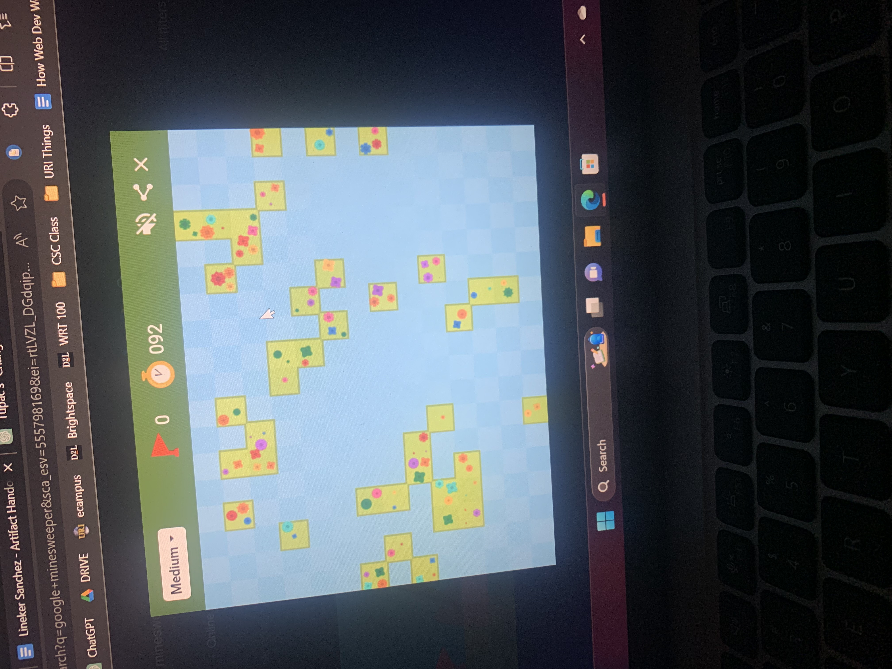
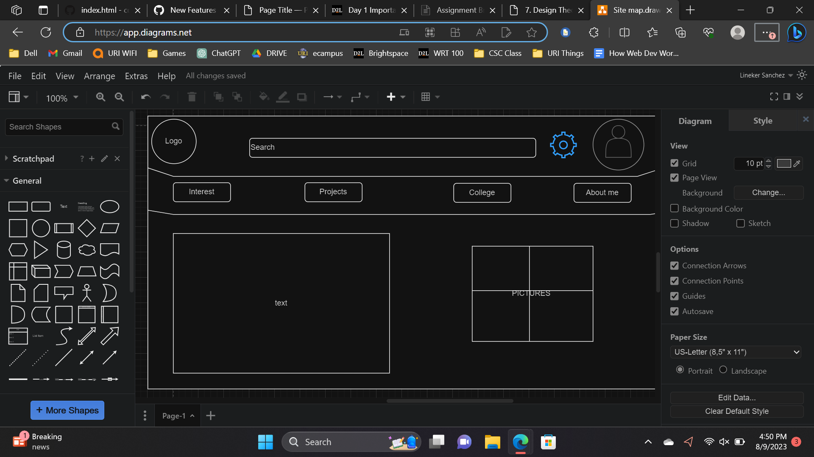

# My TD Experience

<div id="slideshow">

```{include} _static/buttons.html
```

```{card} 
:class-card: slide


```

```{card} 
:class-card: slide


```

```{card} 
:class-card: slide


```

```{card} 
:class-card: slide


```

```{card} 
:class-card: slide


```

```{card} 
:class-card: slide


```


```{card} 
:class-card: slide


```

```{card} 
:class-card: slide


```

```{card} 
:class-card: slide


```

```{card} 
:class-card: slide


```

```{card} 
:class-card: slide


```

```{card} 
:class-card: slide


```

```{card} 
:class-card: slide


```

```{card} 
:class-card: slide


```

```{card} 
:class-card: slide


```

```{card} 
:class-card: slide


```

```{card} 
:class-card: slide


```

```{card} 
:class-card: slide


```

```{card} 
:class-card: slide


```

```{card} 
:class-card: slide


```


</div>